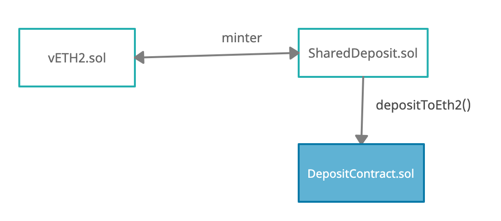

# 🤖 Contracts Explained

The contracts pool users’ ETH, and automatically send 32 ETH batches into AWS-hosted ETH2 validators. Here is what goes down under the hood:

1. Users deposit ETH in our smart contract through a deposit function on our website.
2. This mints vETH2, a token representing their staked position.
3. The ETH supplied is held in a transparent smart contract until we hit a threshold of 10 to 100 validators.
4. At this point an admin can create the private keys and mnemonic via the command line and deposit to the ETH2 staking contract by calling a `deposit_to_eth2` function on our contract.
5. This function transfers the ETH to the ETH2 staking contract by calling deposit and passing in the public key and other information.

This allows people to stake any amount of ETH they want and pool infrastructure costs together. ****

### V2 Planned Architecture


**All of our contracts are open source on** [**Github**](%20https://github.com/SharedStake/Contracts)**.**


